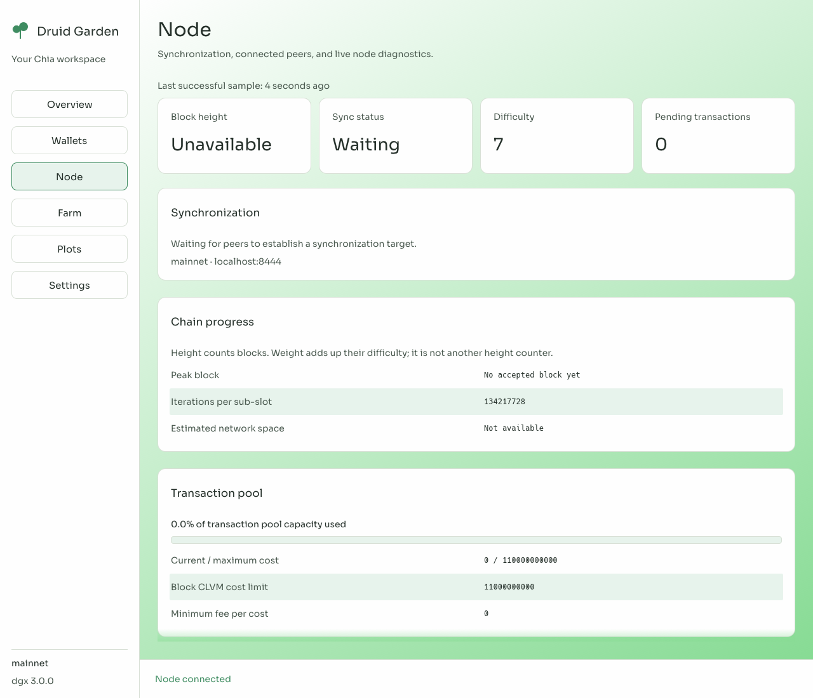
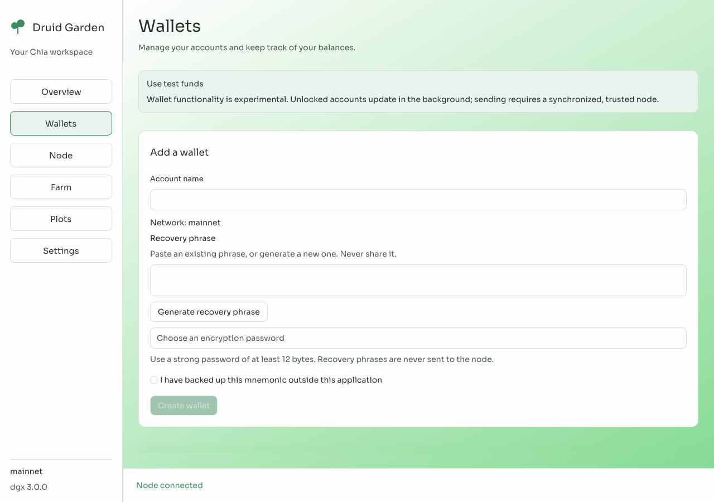
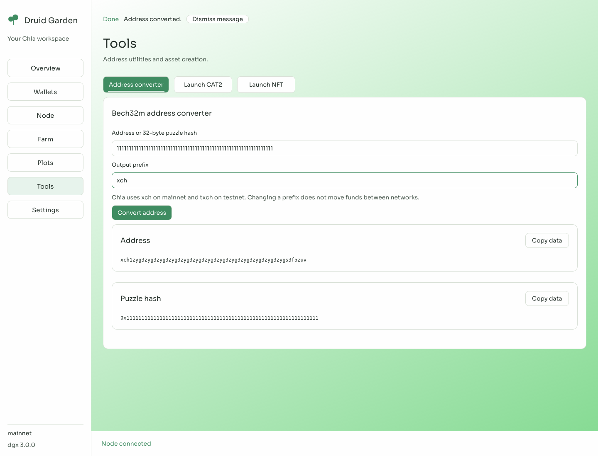
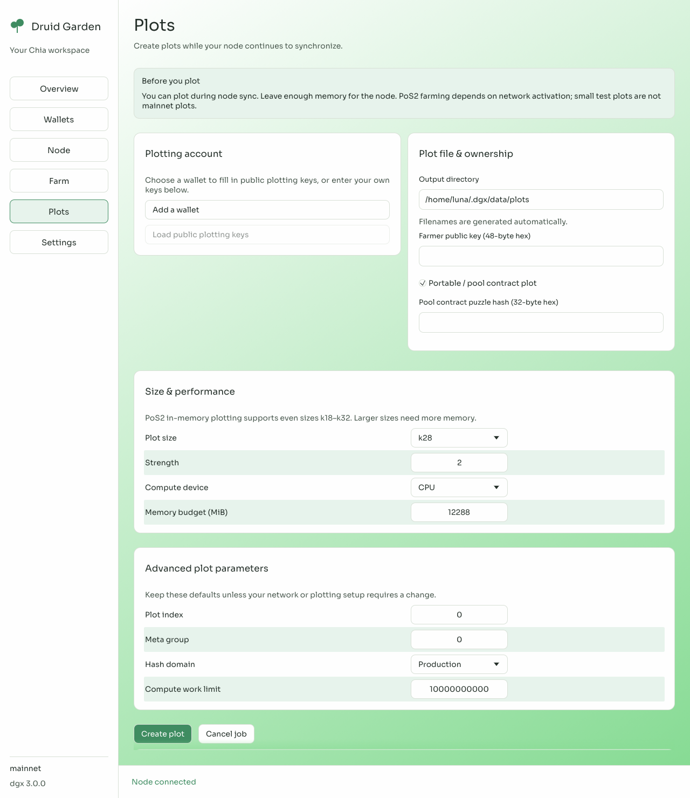
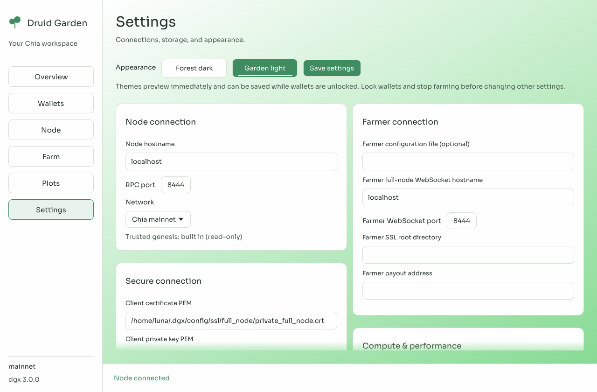

# DruidGarden XCH

A native Rust desktop and command-line toolkit for Chia: run a node, manage wallets, make plots, and farm through `dgx`. No Electron or JavaScript runtime.

The project is still under development. Mainnet compatibility, wallet recovery, and sustained farming need further validation; use test funds while evaluating it.

## Install

Clone the repository, then install from its root with stable Rust:

```sh
git clone https://github.com/GalactechsLLC/dg_xch_utils.git
cd dg_xch_utils
git submodule update --init --recursive
cargo install --path cli --locked
```

Keep Cargo's bin directory on your `PATH`.

- **Linux:** needs a C/C++ toolchain, CMake, m4, pkg-config, OpenSSL headers, libxkbcommon, and X11/Wayland development libraries.
- **macOS:** needs Xcode command-line tools.
- **Windows:** use `cargo install --path cli --locked --no-default-features --features desktop,vulkan` instead. The desktop connects to a separate node; local full-node and timelord builds currently require Linux/macOS.

The standard install includes the desktop, node, farmer, CPU/Vulkan plotter, pool, introducer, and CPU timelord. NVIDIA CUDA uses an [optional helper](plotter/cuda/README.md); AMD compute uses Vulkan.

## Set up and start

```sh
dgx init
dgx full-node
```

Setup asks where to keep configuration, data, and plots. Press Enter for defaults, or choose a larger disk for plots and the node database. **Chia mainnet is the default.**

On Linux, defaults are `~/.dgx/config`, `~/.dgx/data`, and `~/.dgx/data/plots`. macOS and Windows use their native application directories. Setup preserves existing settings and keys.

Leave the node running, then open a second terminal:

```sh
dgx gui
```


Closing the desktop does not stop the separate node. Use Ctrl+C in its terminal when you want to stop it.

## Watch your node sync

Open **Node** to see height, sync status, peers, and pending transactions. Weight is cumulative difficulty, not block height. Hover over labels for explanations.



If disconnected, check that the node is running and Settings points to `localhost:8444` with the TLS credentials from setup. A Chia reference node commonly uses RPC port 8555 and needs its own credentials.

The screenshots show a connected but unsynchronized local node. Connection alone does not mean sync has finished. **You can set up accounts and create plots while syncing.**

## Add wallets

In **Wallets**, create an account or import your recovery phrase. Save the phrase offline and choose a strong password. Unlock multiple accounts to track them in the background while the desktop runs.



Keys are encrypted; balances, transactions, and reservations persist in SQLite. Sending needs a fresh scan from a synchronized node.

Supported workflows include XCH payments, read-only CAT1, CAT2 issuance/transfers, NFT1 minting/transfers, and basic Chia DID1 identities. **Tools** also provides address conversion and XCH/CAT2 offers. Offers are only safely cancelled after on-chain confirmation. NFT offers, DID social recovery, and hardware signing are not available.



Addresses shown in screenshots are examples, not payment destinations. See [wallet backups and limits](wallet/README.md#storage-and-backups) before storing funds.

## Make plots

Open **Plots**, load public keys from an account, and choose an output directory. Filenames are generated automatically. Select CPU or a GPU backend and leave enough RAM for the node and operating system.



The PoS2 plotter defaults to k28, strength 2, targeting `chia-pos2 0.6.0`. Portable plots require your actual pool-contract puzzle hash; choosing one does not create or join a pool.

**Do not replace an existing farm yet.** This checkout's mainnet PoS2 activation constants still need updating and validation. Successful plotting does not establish network eligibility. See [plotter formats and requirements](plotter/README.md).

## Farm and manage pooling

Set plot directories, node credentials, and your payout address in **Settings**. In **Farm**, choose an account and start its farmer. Already-unlocked accounts do not need another password.


The embedded farmer stops when the GUI closes. To run independently with an existing configuration:

```sh
dgx farmer --config /home/user/.dgx/config/farmer.yaml
```

Avoid running both against the same farm. Legacy YAML contains plaintext farming keys; protect it.

For an already configured pool account, **Farm → Pool settings** loads the pool's current payout instructions and difficulty. Changes are explicit; background polling does not overwrite them. Pool joining and registration are not yet part of the GUI.

Developers running a pool can use [dgx pool](pool/README.md). The reference supports v1 and experimental v2, but is not ready to hold real pool funds.

## Settings and help

Choose Garden light or Forest dark, change connections, and review storage paths in **Settings**.



- Run `dgx --help` or a command's `--help` for options.
- If setup used a custom directory, pass `--config-dir /path/to/config` on later commands.
- If wallet data looks stale, check node sync and account errors. Do not delete its database to clear a pending transaction.
- Lock accounts and stop farming before changing node endpoints.

## Package reference

Package READMEs cover configuration and Rust integration.

| Applications | Libraries |
| --- | --- |
| [CLI](cli/README.md), [desktop](gui/README.md), [wallet](wallet/README.md) | [Core](core/README.md), [keys](keys/README.md), [puzzles](puzzles/README.md) |
| [Full node](full-node/README.md), [farmer](farmer/README.md), [pool](pool/README.md) | [Node engine](node/README.md), [P2P](p2p/README.md), [stores](stores/README.md) |
| [Plotter](plotter/README.md), [CUDA helper](plotter/cuda/README.md) | [Proof facade](proof_of_space/README.md), [PoS1](proof_of_space/pos1/README.md), [PoS2](proof_of_space/pos2/README.md), [shared codecs](proof_of_space/pos_common/README.md) |
| [Timelord](timelord/README.md), [introducer](introducer/README.md) | [VDF](vdf/README.md), [weight proofs](weight-proof/README.md), [clients](clients/README.md), [servers](servers/README.md) |
| [Simulator](simulator/README.md), [developer tools](tools/README.md), [fuzzing](fuzz/README.md) | [Serialization](serialize/README.md), [macros](macros/README.md), [parser macro](parser_macro/README.md), [logging](logging/README.md) |
