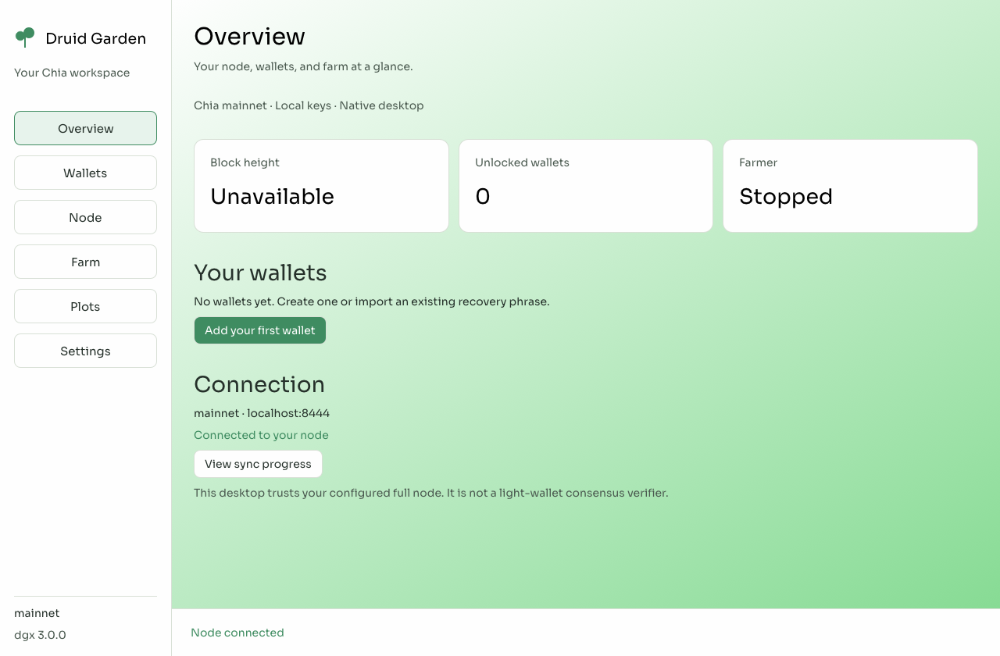
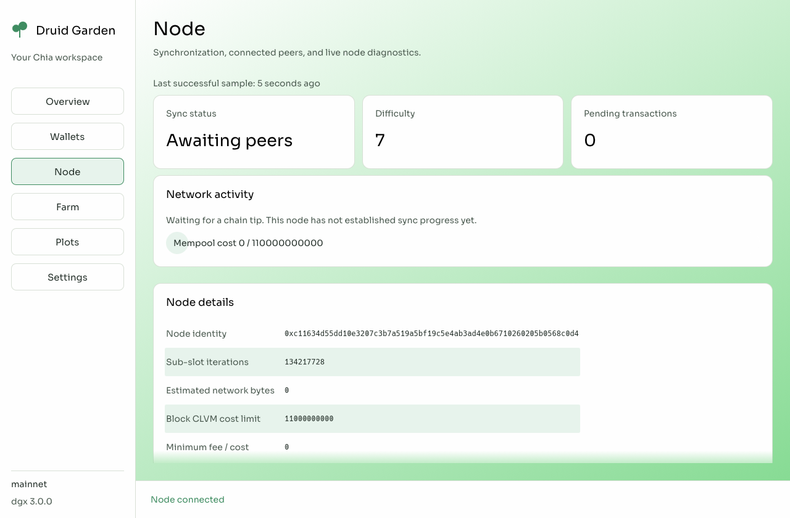
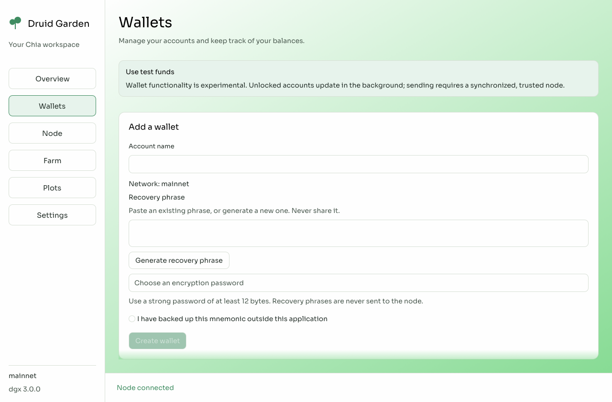
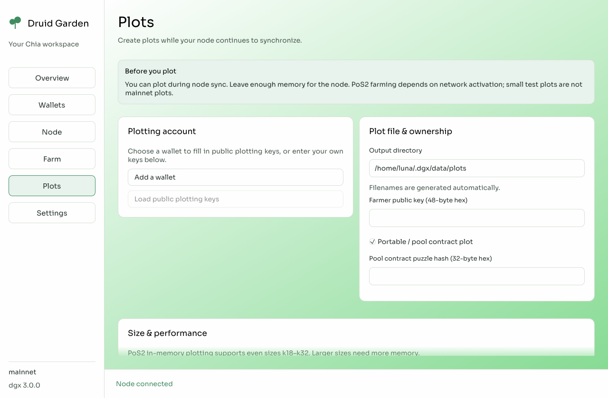
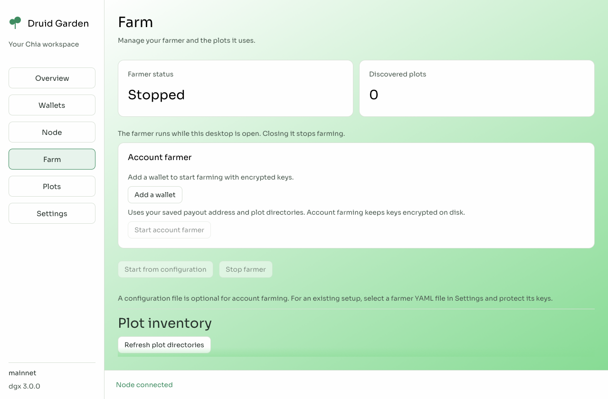
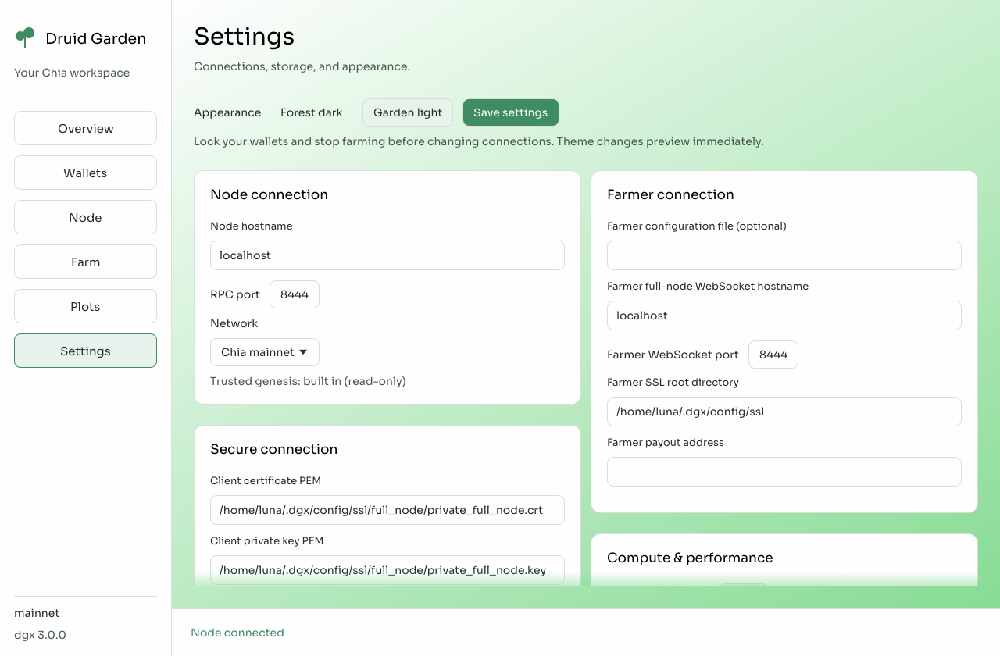

# DruidGarden XCH

One native application and Rust tools for running a Chia node, managing wallets, plotting, and farming. No Electron or JavaScript runtime. `dgx` is the command-line starting point.

This project is under active development. Use a separate wallet with test funds while evaluating it. Local integration tests do not establish complete mainnet compatibility, wallet recovery, or sustained farming performance.

## 1. Install

Build from this checkout with stable Rust and a native build toolchain:

```sh
git submodule update --init --recursive
cargo install --path cli --locked
dgx --help
```

One install provides the desktop, node, farmer, CPU/Vulkan plotter, introducer, and CPU timelord in `dgx`. Put Cargo's `bin` directory on `PATH`; there are no companion applications to install.

Linux needs a C/C++ toolchain, CMake, m4, pkg-config, OpenSSL headers, libxkbcommon, and Wayland/X11 development libraries. macOS needs Xcode command-line tools. The local full node currently targets Linux and macOS because of GMP. On Windows, install the CLI with `cargo install --path cli --locked --no-default-features --features desktop,vulkan`, then run `dgx init` and `dgx gui`. Connect it to an existing compatible node in Settings; the portable Windows CLI does not include a local full node. See the [desktop package](gui/README.md).

CUDA is optional and [built separately](plotter/cuda/README.md). AMD compute uses Vulkan. Without a supported compute device, choose CPU plotting. Desktop rendering and plotting have separate GPU paths.

## 2. Initialize

```sh
dgx init
```

Setup asks where to keep configuration, node/wallet data, and plots. Press Enter for sane per-user defaults. Plots default to a `plots` directory inside application data; choose a disk with enough room and leave space for the growing node database.

On Linux, new profiles use `~/.dgx/config`, `~/.dgx/data`, and `~/.dgx/data/plots` (for example, `/home/user/.dgx/config`). macOS and Windows use their native per-user application directories. Existing initialized profiles remain discoverable at their previous location; no wallets or databases are moved automatically.

Initialization selects **Chia mainnet**, creates local TLS credentials, and configures the desktop for the local node on port 8444. It does not start services, create wallet keys, or download the blockchain. Repeating initialization preserves existing settings and keys.

For a non-default configuration directory, use the printed `--config-dir` argument on subsequent commands or set `DGX_CONFIG_DIR`. Unattended setup:

```sh
dgx --config-dir /absolute/path/config init --non-interactive \
  --data-dir /absolute/path/data --plots-dir /absolute/path/plots
```

Existing desktop preferences are retained. Check Settings after upgrading; initialization does not move existing wallets or databases.

## 3. Start the node and desktop

In one terminal, leave the node running:

```sh
dgx full-node
```

In a second terminal:

```sh
dgx gui
```

The node uses Chia's introducer to discover peers and validates downloaded blocks. The GUI does not own the separate node process: closing it leaves the node running. Stop the node with Ctrl+C. Never run two nodes against one database.



The interface follows the Druid Garden website: a white-to-green background, soft cards, and readable Sora type. Garden light is the default for new profiles; Forest dark remains available in Settings, and saved theme choices are preserved. Wallets, plotting controls, and node data use visible sections rather than collapsed dropdowns.

These are real application screenshots connected to a running local Chia-configured node. The node has not synchronized yet, so no block height or wallet balances are fabricated. “Node connected” confirms the GUI connection, not completed blockchain synchronization.

## 4. Watch synchronization

Open **Node** for sync progress, difficulty, mempool activity, and internal diagnostics. Overview displays the latest observed height. A disconnected/stale message means no fresh sample is available, not that synchronization finished.



If disconnected, check that the node is running and Settings points to `localhost:8444` with the TLS files created during initialization. This node shares its peer and RPC listener. A Chia reference node commonly uses a different RPC port and needs its own trusted client credentials. Never disable certificate verification. Detailed internals require this project's node endpoint.

Initial sync takes time and disk space. **You can create accounts and plots while it runs.** Sending requires a synchronized node and a fresh wallet scan.

## 5. Add wallets

Open **Wallets** and use the visible **Add a wallet** section. Generate a new 24-word wallet or import your own recovery phrase, name it, and choose a strong password. Back up the phrase independently before confirming and creating the account. Never share it or put it in command-line arguments.



In Settings, choose **Chia mainnet** (the default) or **Chia testnet11** from the Network dropdown. Their trusted genesis block header hashes are built in and cannot be edited. No manual hash entry is needed. The wallet still rejects a node reporting a different genesis block.

Unlock each account you want tracked. Multiple accounts update in the background while the desktop runs. Encrypted keys and SQLite wallet state persist across restarts. Cached balances may be stale; sending needs a fresh scan. Standard payments are supported; CATs, NFTs, offers, and hardware signing are not exposed.

Keep recovery phrases separate from the computer. For file-copy backups, close the desktop and copy account files and complete wallet directories, including any SQLite WAL files. See [wallet backup and recovery](wallet/README.md).

## 6. Create plots while syncing

Open **Plots**. No synchronized node or unlocked wallet session is needed.



1. Under **Plotting account**, select an account, enter its password, and load the public keys. Choose **Use loaded keys for a self-farming plot**. For a portable plot, supply your actual pool contract puzzle hash instead; this GUI does not create or join a pool.
2. Choose an output directory. The filename is generated automatically as `plot-k<size>-YYYY-MM-DD-HH-MM-<plot-ID>.plot` using the UTC start time and actual plot ID. Existing files are never overwritten. Use distinct plot identity inputs, such as a new index, for subsequent plots; renaming an identical plot adds no farming capacity.
3. The defaults are **k28, strength 2** for the implementation's pinned format. Higher strengths take more work. Leave RAM for the node and operating system; a memory budget is a limit, not a reservation.
4. Leave GPU unchecked for CPU plotting. Otherwise configure Auto, CUDA, or Vulkan in Settings, select the device, then enable GPU. CUDA needs the helper's absolute path; CUDA and Vulkan device ordinals may differ.
5. Select **Create plot**, watch job status, and cancel if needed. One desktop plotting job runs at a time. Completed files can be discovered without restarting the node.

**Do not replace your existing farm based solely on this guide.** The plotter targets `chia-pos2 0.6.0`. Chia's [PoS2 FAQ](https://docs.chia.net/chia-blockchain/consensus/proof-of-space-2.0/new-proof-faq/) schedules activation at height 9,562,000. Accepted formats, activation rules, and strength conventions must match the network. Small development plots are not mainnet plots. Read [plotter compatibility and limits](plotter/README.md) before making a large batch.

## 7. Configure farming

This checkout still has a placeholder mainnet PoS2 activation height in its consensus constants. Do not treat it as Chia 3.0 mainnet-ready or expect newly created PoS2 plots to earn rewards yet. Updating and validating those network rules is separate from the plotting workflow.

In **Settings**, set plot directories, the farmer's node connection, TLS directory, and payout address, then save. In **Farm**, refresh the inventory and select an account under **Account farmer** to start its farmer. Account mode derives keys in memory for self-farming. Existing compatible farmer YAML supports other configurations, including pool credentials and explicit GPU proving settings.



Check loaded plots, continuing signage points, and proof activity as the node becomes ready. A running process or loaded plot does not prove accepted blocks or rewards. PoS1/PoS2 eligibility follows network activation rules.

The embedded farmer stops when the desktop closes. To run independently, use `dgx farmer --config /absolute/path/farmer.yaml`. Avoid accidentally running both against the same farm. Protect YAML files containing plaintext farming keys. See [farmer configuration](farmer/README.md) for CPU, CUDA, and Vulkan proving.

## Appearance and settings

Open **Settings** to change connections, plot directories, and appearance. Choose **Garden light** for the green theme shown here, then **Save settings**. Existing profiles keep their previously saved theme.



## Troubleshooting

- **Run dgx init first:** initialize, or select the same configuration directory used during setup.
- **Command unavailable:** check build features with `dgx --help`; Windows desktop builds omit the local node and timelord.
- **Plot resource errors:** check RAM/VRAM, work limits, output space, and drivers. Leave capacity for node sync; do not raise budgets beyond available memory.
- **Wallet not updating:** check node sync, trusted RPC credentials, genesis settings, and account errors. Do not delete a database to clear a pending transaction.
- **Changing endpoints:** stop farming and lock all accounts first. Keep real keys and production data out of test environments.

## Package reference

Package READMEs cover APIs, development builds, configuration, and focused tests.

| Applications | Libraries |
| --- | --- |
| [CLI](cli/README.md), [desktop](gui/README.md), [wallet](wallet/README.md) | [Core](core/README.md), [keys](keys/README.md), [puzzles](puzzles/README.md) |
| [Full node](full-node/README.md), [farmer](farmer/README.md) | [Node engine](node/README.md), [P2P](p2p/README.md), [stores](stores/README.md) |
| [Plotter](plotter/README.md), [CUDA helper](plotter/cuda/README.md) | [Proof facade](proof_of_space/README.md), [PoS1](proof_of_space/pos1/README.md), [PoS2](proof_of_space/pos2/README.md), [shared codecs](proof_of_space/pos_common/README.md) |
| [Timelord](timelord/README.md), [introducer](introducer/README.md) | [VDF](vdf/README.md), [weight proofs](weight-proof/README.md), [clients](clients/README.md), [servers](servers/README.md) |
| [Simulator](simulator/README.md), [developer tools](tools/README.md), [fuzzing](fuzz/README.md) | [Serialization](serialize/README.md), [macros](macros/README.md), [parser macro](parser_macro/README.md), [logging](logging/README.md) |
